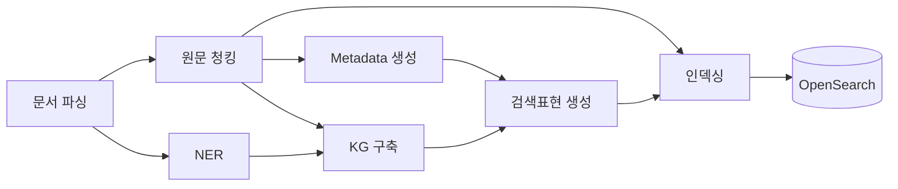
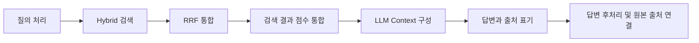

# 데이터 흐름

문서 한 건과 질의 한 건이 Struct4Search 안에서 어떤 단계를 거쳐 결과가 되는지 보여 줍니다.

## 문서가 검색 데이터가 되기까지

**문서 파싱** — 디지털 PDF와 스캔 문서를 각각 다른 파서로 읽어 표준 문서 표현으로 통합합니다. 이후 단계는 모두 이 하나의 구조를 씁니다.

**원문 청킹** — 본문을 일정한 크기로 잘라 검색 단위를 만듭니다. 이 청크가 이후 모든 근거의 위치 기준이 됩니다.

**NER** — 문서에서 엔티티를 뽑습니다. 청킹과 나란히 갈라져 나옵니다.

**Metadata 생성** — 원문 청크를 근거로 문서의 도메인 정보를 18종으로 정리합니다.

**KG 구축** — 같은 엔티티가 나오는 가까운 청크를 묶어 관계를 뽑고 문서 단위 지식그래프로 만듭니다.

**검색표현 생성** — 지식그래프의 관계를 Metadata로 보강해 검색용 문장을 만듭니다. Metadata와 지식그래프가 **둘 다** 있어야 합니다.

**인덱싱** — 원문 청크와 검색표현을 각각 검색 단위로 만들어 텍스트와 벡터를 함께 저장합니다. 둘은 **하나의 OpenSearch 인덱스**에 들어갑니다.

## 질의가 답변이 되기까지

**질의 처리** — BM25에는 질의 원문을 그대로 쓰고, Dense 검색을 위해 임베딩 벡터를 만듭니다.

**Hybrid 검색** — 하나의 인덱스에서 원문 청크와 검색표현을 함께 훑습니다. 두 채널의 검색이 OpenSearch 안에서 일어납니다.

**RRF 통합** — 두 채널의 순위를 통합해 후보를 추립니다. 여기까지가 OpenSearch의 몫입니다.

**검색 결과 점수 통합** — 검색표현의 점수를 연결된 원문 청크로 넘기고, 청크마다 가장 높은 점수를 남겨 최종 근거를 고릅니다. 여기서부터 애플리케이션이 일합니다.

**LLM Context 구성** — 고른 원문 청크를 근거로 렌더합니다. 검색표현을 통해 올라온 청크에만 그 표현이 인용 불가 표시와 함께 붙습니다.

**답변과 출처 표기** — 모델이 주장 문장과 그 문장이 인용한 원문 청크 ID를 함께 냅니다.

**답변 후처리 및 원본 출처 연결** — 인용을 정리하고 문서와 원본 페이지로 이어 사용자에게 보일 형태를 만듭니다.

## 두 흐름이 만나는 곳

두 파이프라인은 코드를 공유하지 않습니다. **OpenSearch 인덱스 하나**를 통해서만 만납니다. 인덱싱이 그 안에 검색 단위를 넣고, 검색이 그것을 조회합니다.

그래서 인덱싱 쪽 설정이 바뀌면 검색 결과가 달라지고, 검색 쪽 값을 바꿔도 색인은 그대로입니다.
