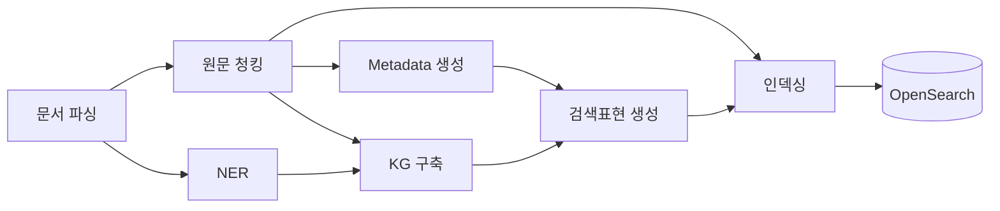
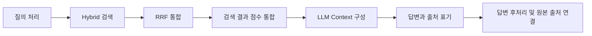

# 데이터 흐름

문서 한 건이 검색 데이터가 되고, 질의 한 건이 답변과 출처로 반환되기까지의 흐름을 보여 줍니다.

## 문서가 검색 데이터가 되기까지

- **문서 파싱** — 디지털 PDF와 스캔·복합 문서를 파싱한 뒤 이후 단계에서 공통으로 사용할 수 있는 문서 구조로 통합합니다.

- **원문 청킹** — 원문을 일정한 크기의 검색 단위로 나눕니다.

- **NER** — 문서에서 주요 Entity를 추출하고, KG 구축에 필요한 정보를 만듭니다.

- **Metadata 생성** — 원문 청크를 바탕으로 문서의 도메인 정보를 18종 Metadata로 정리합니다.

- **KG 구축** — 같은 Entity가 등장하는 가까운 청크를 묶어 관계를 추출하고 문서 단위 지식그래프를 구성합니다.

- **검색표현 생성** — 지식그래프의 관계와 Metadata를 결합해 원문 검색을 보조하는 검색표현을 만듭니다.

- **인덱싱** — 원문 청크와 검색표현을 각각 검색 단위로 구성하고 텍스트와 임베딩 벡터를 OpenSearch에 저장합니다.

## 질의가 답변이 되기까지

- **질의 처리** — BM25 검색에는 질의 원문을 사용하고, Dense 검색을 위해 질의 임베딩을 생성합니다.

- **Hybrid 검색** — OpenSearch에서 원문 청크와 검색표현을 대상으로 BM25와 Dense 검색을 수행합니다.

- **RRF 통합** — OpenSearch가 두 검색 결과의 순위를 RRF로 통합해 다음 단계에서 사용할 후보를 반환합니다.

- **검색 결과 점수 통합** — 검색표현을 연결된 원문 청크로 투영하고, 원문 청크별 점수를 정리해 최종 Top-10 원문 청크를 선정합니다.

- **LLM Context 구성** — 선정된 원문 청크로 답변 근거를 구성합니다. 검색표현을 통해 검색된 청크에는 해당 검색표현을 보조 정보로 함께 제공합니다.

- **답변과 출처 표기** — LLM이 답변을 생성하고 각 claim에 사용한 원문 청크 ID를 함께 반환합니다.

- **답변 후처리 및 원본 출처 연결** — 인용을 정리하고 원문 청크를 실제 문서와 페이지에 연결해 사용자에게 반환할 형태로 구성합니다.

## 두 흐름의 연결

문서 인덱싱 파이프라인이 OpenSearch에 검색 데이터를 저장하고, 검색·답변 파이프라인이 이를 조회해 답변을 만듭니다.

따라서 인덱싱 결과가 달라지면 이후 검색 결과도 달라질 수 있지만, 검색·답변 단계의 설정만 변경하는 경우 기존 색인은 그대로 사용할 수 있습니다.
