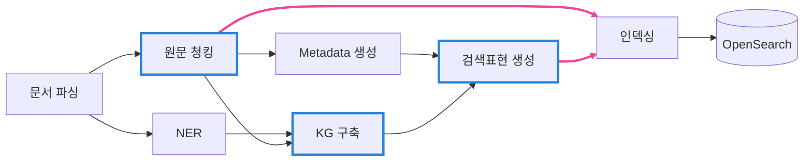

# 문서 인덱싱 파이프라인

문서 한 건을 받아 검색 가능한 데이터로 바꿉니다. 원문 청크와 검색표현 두 종류를 만들어 하나의 OpenSearch 인덱스에 넣는 것이 이 파이프라인의 결과입니다.

## 전체 흐름

파싱이 끝나면 청킹과 NER이 동시에 갈라집니다. 원문 청크는 Metadata 생성·KG 구축·인덱싱 세 곳으로 흐르고, 검색표현은 Metadata와 KG가 **둘 다** 있어야 만들어집니다.

## 단계별 입력과 출력

| 단계 | 입력 | 출력 |
|---|---|---|
| [문서 파싱](parsing.md) | PDF | IDR |
| [원문 청킹](chunking.md) | IDR | 원문 청크 |
| [NER](ner.md) | IDR | 엔티티 언급과 유형 |
| [Metadata 생성](metadata.md) | 원문 청크 | 18종 Metadata |
| [KG 구축](triple-kg.md) | 원문 청크 + 엔티티 | Triple과 문서 지식그래프 |
| [검색표현 생성](retrieval-text.md) | 지식그래프 + Metadata | 검색표현 |
| [인덱싱](opensearch.md) | 원문 청크 + 검색표현 | OpenSearch 검색 단위 |

## 검색 단위가 두 종류인 이유

원문 청크만 색인하면 **질의의 어휘가 원문과 다를 때 찾지 못합니다.** "이 공정에서는 내부 온도가 급격히 상승하였다"라는 원문은 "곡성 공장 화재"로 검색되지 않습니다.

검색표현이 그 간극을 메웁니다. 문서의 지식그래프와 Metadata로 다시 쓴 문장이라, 원문에 없던 어휘로도 그 원문에 도달합니다.

대신 검색표현은 생성된 문장이므로 **답변의 근거가 될 수 없습니다.** 검색에 걸리면 자기 점수를 연결된 원문 청크로 넘기고 순위에서 빠집니다([검색 결과 점수 통합](../query/score-integration.md)).

## 이 파이프라인이 하지 않는 일

- 이미지나 차트의 설명을 생성하지 않습니다. 파서는 텍스트와 그 출처만 냅니다.
- 지식그래프를 문서 밖으로 넓히지 않습니다. 같은 이름의 엔티티라도 문서를 넘어 통합하지 않습니다.
- Metadata·Triple·검색표현이 비어도 원문 청크는 그대로 색인됩니다.

## 실행

실행 명령과 재개, 재처리 범위는 [실행과 재처리](rerun.md)에 있습니다.
