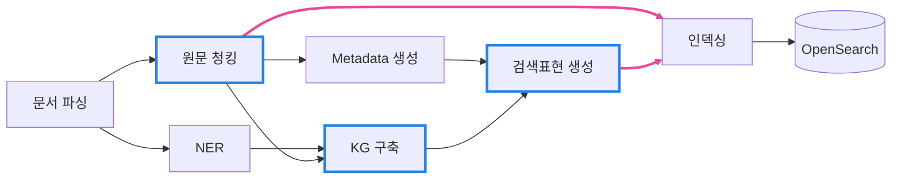

# 문서 인덱싱 파이프라인

문서 인덱싱 파이프라인은 입력 문서를 검색에 사용할 수 있는 데이터로 만드는 파이프라인입니다. 문서를 파싱하고 원문을 청킹한 뒤 NER, Metadata 생성, KG 구축을 통해 문서의 정보를 보강하고, 이를 바탕으로 검색표현을 생성합니다. 마지막으로 원문 청크와 검색표현을 각각 텍스트와 임베딩 벡터로 구성해 OpenSearch에 저장하며, 이후 검색·답변 파이프라인이 이 데이터를 사용합니다.

## 전체 흐름

파싱이 끝나면 청킹과 NER이 동시에 수행됩니다. 원문 청크는 Metadata 생성·KG 구축·인덱싱 순서대로 처리됩니다. 검색표현은 Metadata와 KG가 **둘 다** 있어야 만들어집니다.

## 단계별 입력과 출력

| 단계 | 입력 | 출력 | 현재 모델·교체 옵션 |
|---|---|---|---|
| [문서 파싱](parsing.md) | PDF | IDR | 디지털 페이지: PyMuPDF4LLM(라이브러리) 스캔·복합 페이지: MinerU2.5-Pro-2605 |
| [원문 청킹](chunking.md) | IDR | 원문 청크 | 모델 미사용 (`nlpai-lab/KURE-v1` tokenizer) |
| [NER](ner.md) | IDR | 엔티티 언급과 유형 | `urchade/gliner_multi-v2.1` |
| [Metadata 생성](metadata.md) | 원문 청크 | 18종 Metadata | 기본: `Qwen/Qwen3-14B` 교체 가능: `gpt-5.6-luna` · `gpt-5.6-terra` · `gpt-5.6-sol` |
| [KG 구축](triple-kg.md) | 원문 청크 + 엔티티 | Triple과 문서 지식그래프 | 기본: `Qwen/Qwen3-14B` 교체 가능: `gpt-5.6-luna` · `gpt-5.6-terra` · `gpt-5.6-sol` |
| [검색표현 생성](retrieval-text.md) | 지식그래프 + Metadata | 검색표현 | 기본: `Qwen/Qwen3-14B` 교체 가능: `gpt-5.6-luna` · `gpt-5.6-terra` · `gpt-5.6-sol` |
| [인덱싱](opensearch.md) | 원문 청크 + 검색표현 | OpenSearch 검색 단위 | `Qwen/Qwen3-Embedding-8B` |

기본 모델은 Struct4Search `Master`의 production profile 기준입니다. LLM 모델은 profile에서 한 번 선택하며 Metadata 생성, KG 구축, 검색표현 생성과 답변에 동일하게 적용됩니다.

## 검색 단위가 두 종류인 이유

원문 청크만 색인하면 **질의의 어휘가 원문과 다를 때 찾지 못합니다.** "이 공정에서는 내부 온도가 급격히 상승하였다"라는 원문은 "곡성 공장 화재"로 검색되지 않습니다.

검색표현이 그 간극을 메웁니다. 문서의 지식그래프와 Metadata로 다시 쓴 문장이라, 원문에 없던 어휘로도 그 원문에 도달합니다.

예를 들어 다음과 같이 원문의 불명확한 표현에 문서의 장소·공정·사고 정보를 보충합니다.

| 구분 | 내용 |
|---|---|
| 원문 청크 | `이 공정에서는 내부 온도가 급격히 상승하였다.` |
| KG·Metadata | 공정 = 열분해유 제조 공정 · 장비 = 열분해로 · 사고유형 = 화재 · 장소 = 곡성 공장 |
| 검색표현 | `곡성 공장의 열분해유 제조 공정에서 열분해로 내부 온도가 급격히 상승한 화재 사고` |
| 사용자 질의 | `곡성 공장 화재` |

원문에는 `곡성 공장`이나 `화재`라는 단어가 없지만 검색표현에는 이 정보가 포함되어 있어 질의와 일치할 수 있습니다. 이렇게 검색표현을 통해 관련 원문 청크까지 찾습니다.

대신 검색표현은 생성된 문장이므로 **답변의 근거가 될 수 없습니다.** 검색에 걸리면 자기 점수를 연결된 원문 청크로 넘기고 순위에서 빠집니다([검색 결과 점수 통합](../query/score-integration.md)).

## 실행

실행 명령과 재개, 재처리 범위는 [실행과 재처리](rerun.md)에 있습니다.
