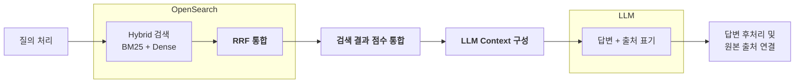

# 검색·답변 파이프라인

사용자 질의를 받아 원문 근거가 붙은 답변을 반환합니다. 검색은 원문 청크와 검색표현을 함께 대상으로 하지만, **최종 근거와 인용은 언제나 원문 청크입니다.**

## 전체 흐름

BM25 검색, Dense 검색, RRF 통합은 모두 **OpenSearch 안에서** 끝납니다. 애플리케이션이 일을 시작하는 시점은 OpenSearch가 통합된 Top-30을 돌려준 뒤입니다.

## 단계별 입력과 출력

| 단계 | 입력 | 출력 |
|---|---|---|
| [질의 처리](request.md) | 사용자 질의 | `query text`와 `query embedding` |
| [Hybrid 검색](hybrid-search.md) | query text와 embedding | 두 채널을 통합한 후보 |
| [RRF 통합](rrf.md) | 두 채널의 후보 | Top-30 후보 |
| [검색 결과 점수 통합](score-integration.md) | Top-30 후보 | Top-10 원문 청크 |
| [LLM Context 구성](context.md) | Top-10 원문 청크 | 시스템 프롬프트 + 질의 + 근거 |
| [답변과 출처 표기](structured-answer.md) | Context | `claims` |
| [답변 후처리 및 원본 출처 연결](citations.md) | `claims` | 답변과 출처 링크 |

후보 수가 줄어드는 순서가 이 파이프라인의 골격입니다. 채널별 깊이 50에서 시작해 통합 후보 30건, 최종 근거 10건으로 좁아집니다.

## 두 검색 단위의 역할이 다릅니다

| 단위 | ID | 검색 대상 | 인용 가능 |
|---|---|---|---|
| 원문 청크 | `ruf_*` | 예 | **예** |
| 검색표현 | `rte_*` | 예 | **아니오** |

검색표현은 문서의 지식그래프에서 생성한 문장입니다. 질의와 어휘가 다른 원문을 찾아 주는 검색 열쇠이지 사실의 출처가 아닙니다.

이 구분이 무너지면 모델이 만든 문장이 인용문이 되고, 그 순간 답변을 원문과 대조할 방법이 사라집니다. 그래서 검색표현은 [점수 통합](score-integration.md)에서 순위를 원문 청크에 넘기고 빠지며, [답변 Schema](structured-answer.md)의 인용 가능 ID 집합에도 들어가지 않습니다.

## 답변이 할 수 없는 것

- 제공된 원문에 없는 법령·수치·조건·대상·절차를 추가하지 않습니다.
- 검색표현에만 있고 원문에 없는 내용을 답변에 쓰지 않습니다.
- 근거가 전혀 없으면 `claims`를 빈 배열로 반환합니다.
- 질의를 다시 쓰지 않습니다.
